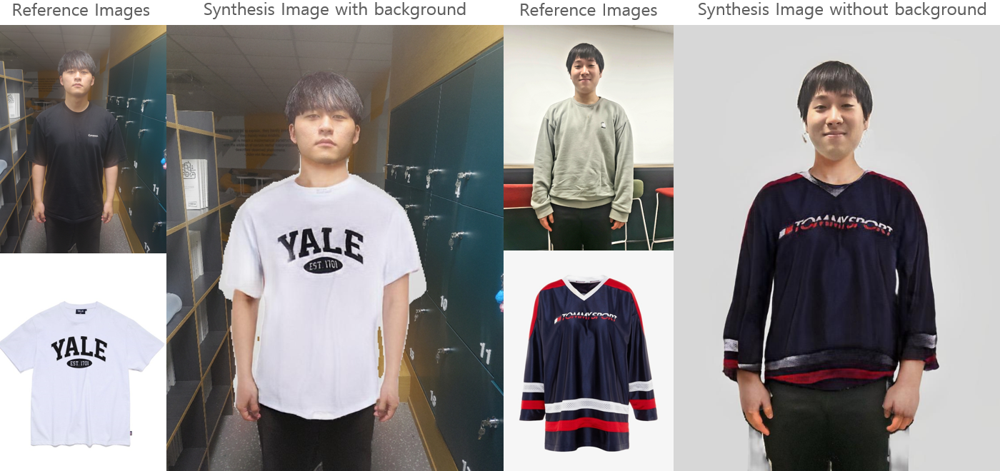

# TryYours - High Resolution Virtual Try On site using HR-VITON.

> [KR presentation](./TryYours_presentation_kr.pdf)

## Colab Demo
You can simply try it using colab

## Team member

|| |
|-|-|
|[Jaeyoon Jung](https://github.com/lastdefiance20), soongsil university|[Seungwoo Han](https://github.com/hswek), soongsil university|

## Process Overview

## Code Running Environment
> ## run at ubuntu
> **use docker image of paperspace gradient Scratch docker**\
> https://hub.docker.com/r/paperspace/gradient-base \
> **docker tag** \
> pt112-tf29-jax0314-py39-20220803

## Installation
~~see [INSTALL.md](./INSTALL.md) for the installation~~
we will add INSTALL.md soon.

## References
#### HR-VITON
https://github.com/sangyun884/HR-VITON
#### Posenet
https://github.com/rwightman/posenet-python
#### Graphonomy
https://github.com/Gaoyiminggithub/Graphonomy
#### detectron2
https://github.com/facebookresearch/detectron2
#### cloth image segmentation
https://github.com/ternaus/cloths_segmentation
